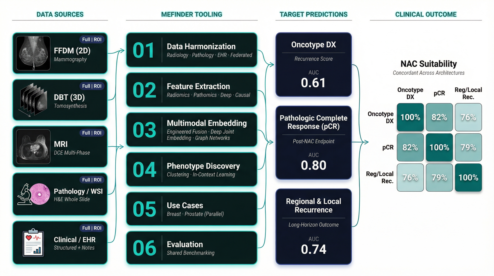
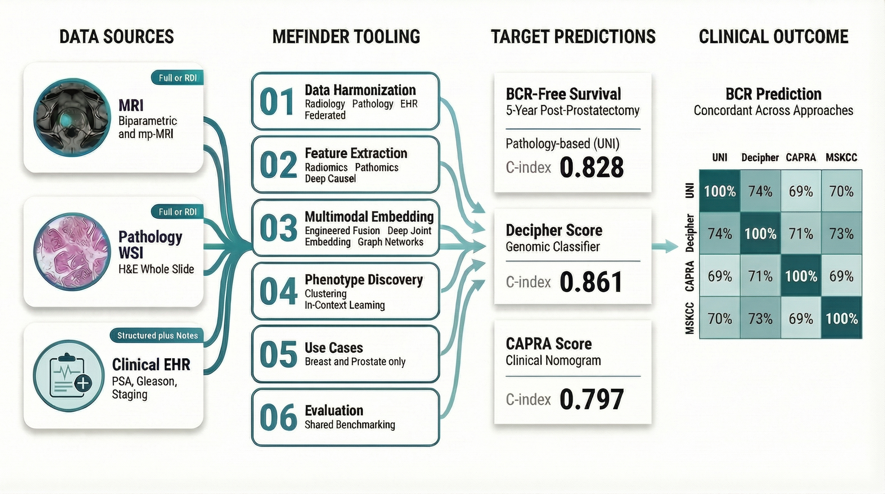

# MEFINDER - Multimodal Tooling Repository

## Overview

MEFINDER (*Multimodal Fusion Initiative for Novel Disease Phenotype Discovery and Population-Specific Risk Prediction*) is an Other Transaction Award (1OT2OD038065-01) funded by the NIH Common Fund and led by Dr. Judy Gichoya at Emory University.

This repository contains the open-source implementation of the MEFINDER framework: a modular, multi-institutional pipeline for integrating radiology imaging, digital pathology, and clinical/EHR data to discover biologically relevant patient phenotypes and enable phenotype-specific cancer risk prediction.

## Motivation / Premise (The Why?)

Multimodal AI promises better clinical predictions by combining diverse data sources — yet the field lacks a standardized playbook for selecting, merging, and validating those inputs. MEFINDER tests a bold, unifying hypothesis: **it shouldn't matter how you build the model — or what you're predicting**. Whether a developer works with Regions of Interest (ROIs) or whole images, fuses two modalities or five, chooses deep learning, graph neural networks, or deep joint embeddings, and whether the target is chemotherapy benefit, treatment response, or disease recurrence — if the tooling is sound, every architecture should classify the same patient in the same direction. We demonstrate that this framework scales across clinical use cases and institutional boundaries, delivering consistent patient-level predictions regardless of site, cohort, or prediction task.

## Use cases 
The framework is validated on two clinical use cases:
1. Using multimodal data to predict the utility of noeadjuvant chemotherapy in patients diagnosed with breast cancer 

2. Using multimodal data to predict biochemical recurrence (BCR) after definitive therapy for patients with prostate cancer. BCR recurrence is used for risk stratification to determine the need for salvage therapies (like radiation or hormonal therapy) to predict the risk of metastasis and mortality.

## Collaborating Institutions

| Institution         | Role             | Key Dataset(s)                                                     |
| ------------------- | ---------------- | ------------------------------------------------------------------ |
| Emory University    | Lead Institution | EMBED v2 (260,815 patients, ~1M exams); EPIP (~7,500 patients)     |
| Mayo Clinic         | Co-investigator  | Mayo Clinic Biobank (75,000+ patients, 10-15 yr follow-up)         |
| Stanford University | Co-investigator  | Stanford Prostate Cohort                                           |
| Indiana University  | Co-investigator  | Breast & Prostate Imaging Cohorts                                  |
| VA Medical Center   | Collaborator     | VA Biparametric MRI (387 patients, pathology digitization ongoing) |
| TCIA / RTOG / EDRN  | Public Datasets  | PICCAI, RTOG Clinical Trial Data, TCIA Collections                 |
